# 游戏总览

SWE-Game 包含 41 款参考游戏。下表列出游戏类型、工程规模和参考录像；各游戏截图见后续条目。

视角分布：2D 24 款、3D 9 款、3D first-person 5 款、3D third-person 3 款。

每款游戏提供一个固定参考工程和一段参考录像，见 [Hugging Face 数据集](https://huggingface.co/datasets/Charly-chan/SWE-Game)。

| 游戏 | 类型 | 视角 |
| --- | --- | --- |
| [3d_platformer](#3d-platformer) | 3D collect-and-deliver platformer… | 3D |
| [arc_wing](#arc-wing) | Vertically-scrolling shoot-'em-up… | 2D |
| [ballast_yard](#ballast-yard) | Single-screen deterministic physi… | 2D |
| [bush_522](#bush-522) | 3D 飞行模拟 / 探索高分游戏 | 3D third-person |
| [canopy_dash](#canopy-dash) | Behind-the-back 3D endless runner… | 3D |
| [cat_defense](#cat-defense) | 2D side-on lane defence with a tr… | 2D |
| [city_delivery](#city-delivery) | 3D delivery dispatch — multi-orde… | 3D |
| [citycab_rush](#citycab-rush) | 3D arcade vehicle / timed deliver… | 3D |
| [cyber_survival](#cyber-survival) | 第三人称 3D 潜入-生存射击（single-run roguel… | 3D |
| [deepgrid](#deepgrid) | Grid-maze first-person shooter in… | 3D first-person |
| [dogwalk](#dogwalk) | 单人第三人称 3D 开放空地探索与搬运差事 | 3D |
| [dont_stop](#dont-stop) | 2D 俯视科幻射击 | 2D |
| [dungeon_escape](#dungeon-escape) | Top-down 2D action-adventure; sin… | 2D |
| [ember_and_tide](#ember-and-tide) | single-player co-operative-pair p… | 2D |
| [gentlemans_adventure](#gentlemans-adventure) | 2D 横版平台射击（side-scrolling run & gu… | 2D |
| [gunfire_dungeon](#gunfire-dungeon) | 2D 俯视地牢射击。 | 2D |
| [harvest_ledger](#harvest-ledger) | 俯视 2D 农场生活模拟 / 有期限的轻策略经营 | 2D |
| [hazard_circuit](#hazard-circuit) | 2D side-view hazard-course parkou… | 2D |
| [hive_flight](#hive-flight) | 2D side-scrolling pixel-art runne… | 2D |
| [hurry_curry](#hurry-curry) | 单人 3D 时间规划/烹饪交互 | 3D |
| [kindle_relay](#kindle-relay) | 3D 球形世界点灯探索 | 3D third-person |
| [ninja_roguelite](#ninja-roguelite) | 俯视 2D 动作 roguelite（run-based，单局制） | 2D |
| [pixel_platformer](#pixel-platformer) | 2D pixel-art puzzle-platformer wi… | 2D |
| [pixel_platformer_v2](#pixel-platformer-v2) | 2D single-screen precision platfo… | 2D |
| [pixel_sabotage](#pixel-sabotage) | Single-player first-person 3D ste… | 3D first-person |
| [pulse_lane](#pulse-lane) | Four-lane vertical-scroll rhythm … | 2D |
| [racing](#racing) | Third-person circuit racer, five-… | 3D |
| [relic_runner](#relic-runner) | Top-down 2D dungeon errand-runner… | 2D |
| [sands_of_the_restless](#sands-of-the-restless) | First-person survival wave shoote… | 3D first-person |
| [shadow_walker](#shadow-walker) | Top-down 2D stealth, single unarm… | 2D |
| [soccer_course](#soccer-course) | Top-down pixel soccer action game | 2D |
| [super_dungeon_delve](#super-dungeon-delve) | 2D 俯视像素动作地牢 | 2D |
| [terraforge](#terraforge) | First-person voxel sandbox with a… | 3D first-person |
| [tiny_rts](#tiny-rts) | 2D 俯视即时战略（RTS），键盘完备操作，英雄带队制。 | 2D |
| [toon_shooter](#toon-shooter) | Third-person 3D arena shooter, wa… | 3D third-person |
| [twin_holds](#twin-holds) | Turn-based strategy on a hexagona… | 3D |
| [vaultline](#vaultline) | 2D precision momentum-parkour pla… | 2D |
| [volley_break](#volley-break) | Single-screen 2D sports/action hy… | 2D |
| [where_the_dead_lie](#where-the-dead-lie) | 单人第一人称 3D 恐怖探索与资源搜索 | 3D first-person |
| [wizard_chase](#wizard-chase) | 2D 俯视单屏迷宫追逐 | 2D |
| [sprout_market](#sprout-market) | Single-screen real-time shop mana… | 2D |

---

## 3d_platformer

**BEACON RELAY** · 3D collect-and-deliver platformer, third-person, fixed-yaw camera · 3D

---

## arc_wing

**Arc Wing (弧翼)** · Vertically-scrolling shoot-'em-up (top-down, fixed camera, no scrolling playfield) · 2D

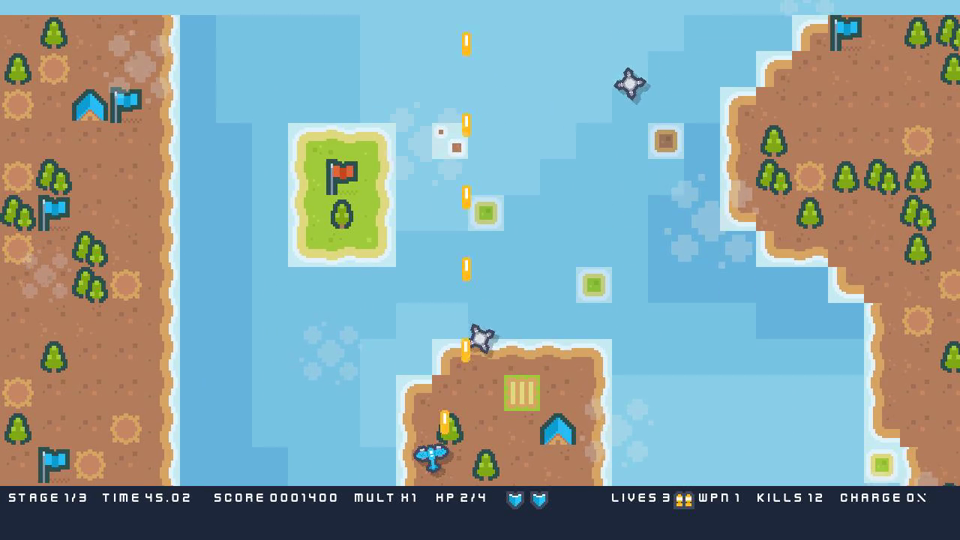

---

## ballast_yard

**Ballast Yard** · Single-screen deterministic physics puzzle (scripted grid simulation, no rigid-body solver) · 2D

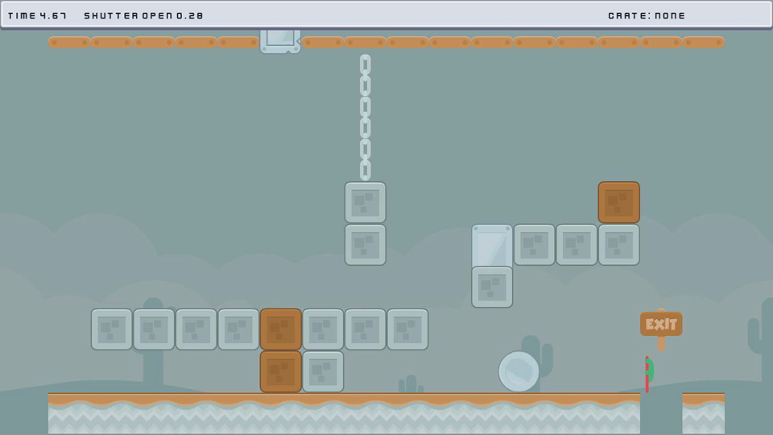

---

## bush_522

**Bush 522** · 3D 飞行模拟 / 探索高分游戏 · 3D third-person

`Bush 522` 是第三人称 3D 检查点飞行课程。玩家在 **4–8 min** 的一局中驾驶一架真实 `RigidBody3D` 灌木飞机，从跑道起飞、管理油门和姿态、寻找红色检查点并减速着陆。交付规模为 **1 independently addressable level**、64 个确定性检查点、1 架飞机及 2 个独立结局。

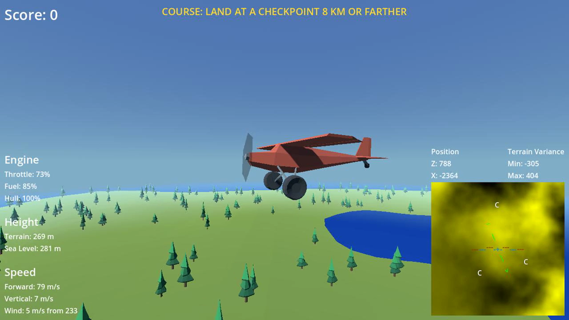

---

## canopy_dash

**Canopy Dash — game design document** · Behind-the-back 3D endless runner (three-lane, jump / slide / turn) · 3D

_磁盘上没有任何截图——这个工程从未被抓过帧。_

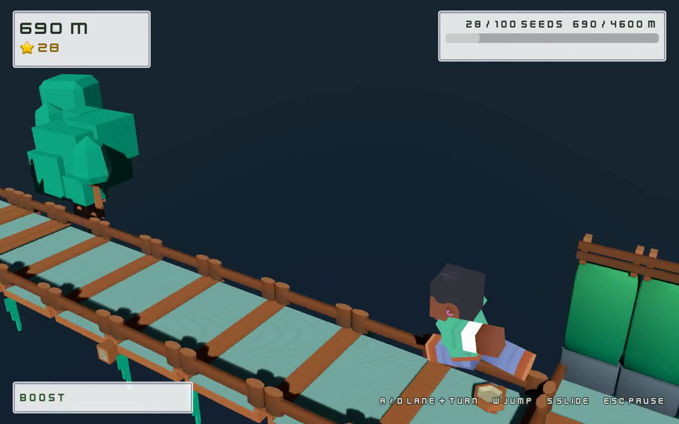

---

## cat_defense

**Last Cat on the Wall** · 2D side-on lane defence with a traversal coda — tower-defence economy inside an action-shooter body · 2D

The run is played in two halves and the same key means different things in each. That is the whole design.

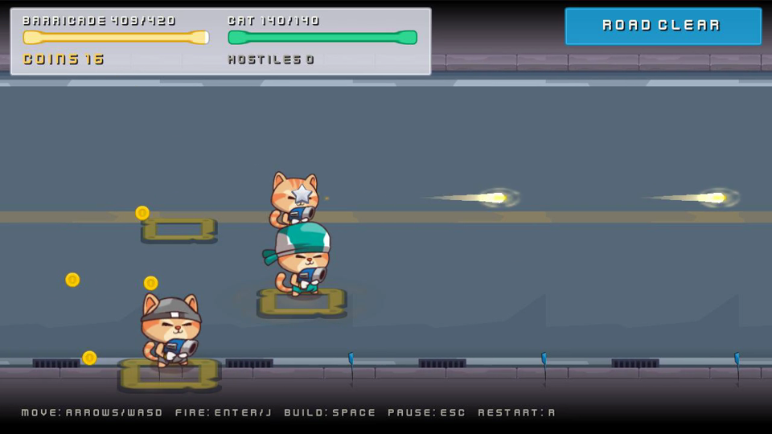

---

## city_delivery

**Manifest Run** · 3D delivery dispatch — multi-order routing under overlapping time windows · 3D

The verb is *drive*, but the **decision** is *which order next*. Speed is only the currency you spend on a scheduling problem: at peak you hold three parcels whose windows close within 20 s of each other, one melts while you drive, one breaks when you brake late, and the heavy one is the reason you brake late.

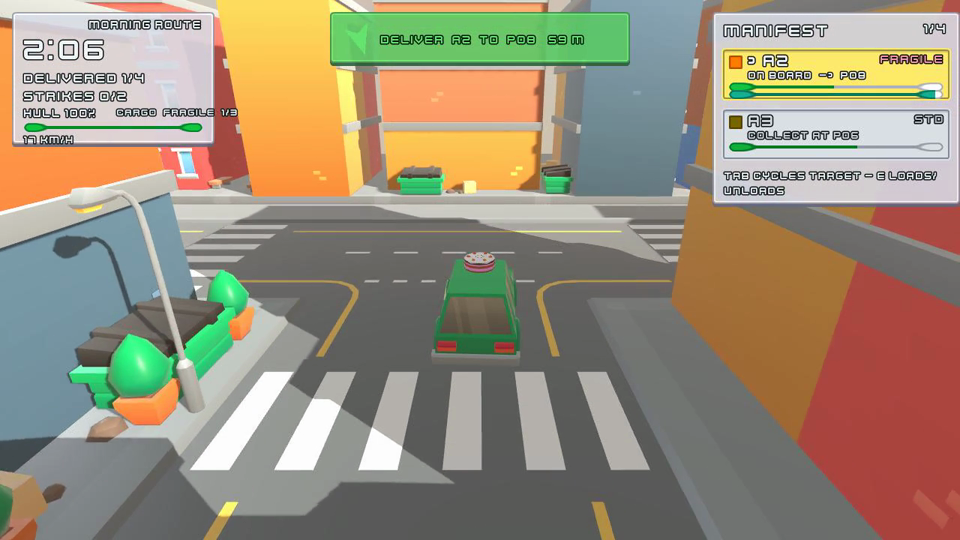

---

## citycab_rush

**CityCab Rush** · 3D arcade vehicle / timed delivery run, fixed chase camera · 3D

The whole game is one verb — *drive* — plus one loop: **find the passenger → carry them → bank the fare before the clock dies**. Everything in the build exists to make that loop legible at a glance: the marker that tells you where to go, the ring that tells you what the fare is still worth, the minimap that tells you how the street grid connects, and a car whose speed you can read from the camera without looking at a number.

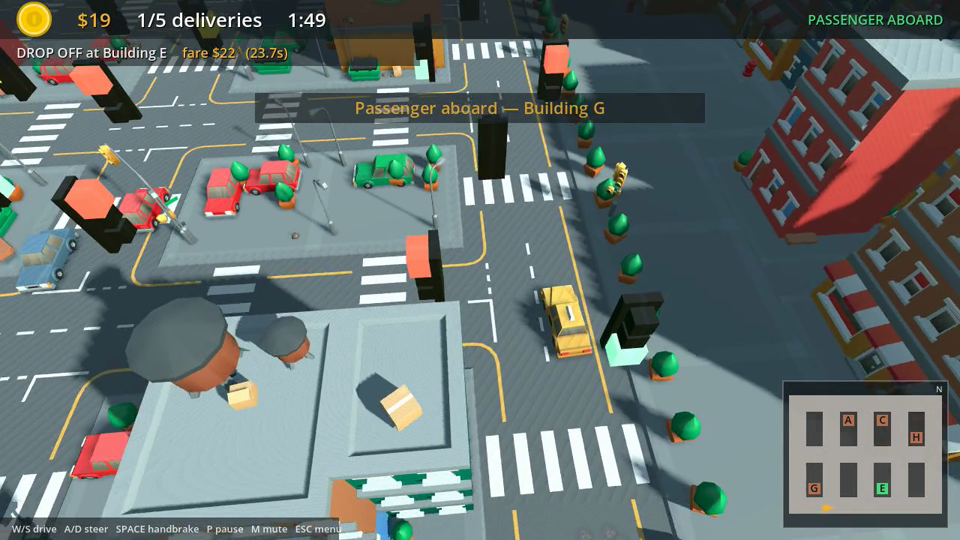

---

## cyber_survival

**Neon Lockdown** · 第三人称 3D 潜入-生存射击（single-run roguelite-lite，无随机生成） · 3D

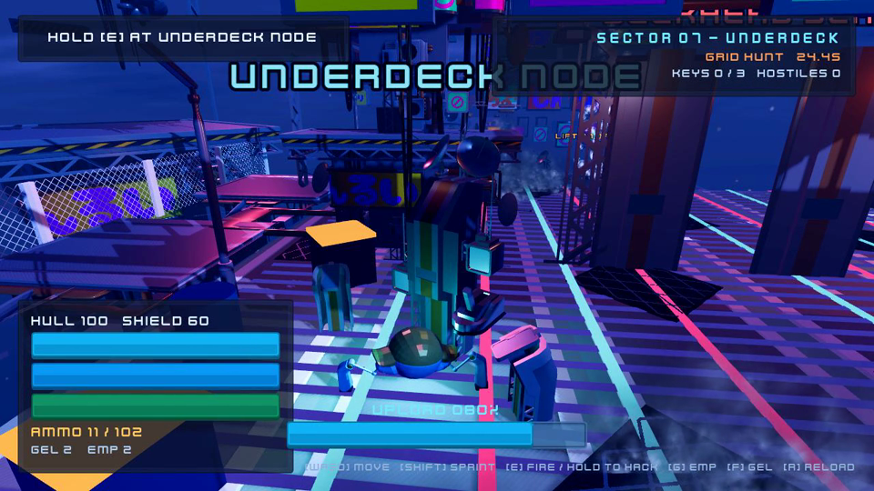

---

## deepgrid

Grid-maze first-person shooter in the classic raycaster idiom · 3D first-person

Deepgrid is a **subterranean automated data vault**. It sealed itself from the inside and its maintenance machines now treat you as contamination. You descend six floors, collect the two keycards that open the service spine and the core vault, break the Overseer, and throw the exit interlock.

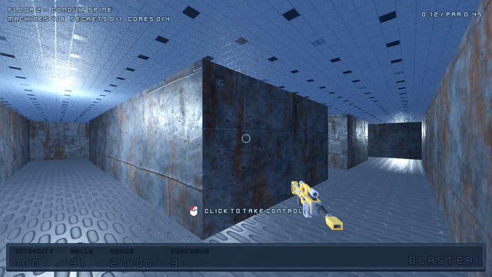

---

## dogwalk

**DOGWALK — CodingBenchmark GDD** · 单人第三人称 3D 开放空地探索与搬运差事 · 3D

上游是 Blender Studio 的 *DOGWALK*（CC BY 4.0）。切片保留原作最有价值的玩法核心： **牵引绳是一条会绕树缠绕的真实绳索**，**Pinda 是有自己意志的同伴而不是跟随的贴图**。 这两点在计划 §9.3 中被明确列为不可简化项，因此上游的 `pinda.gd`（3403 行）、 `chocomel.gd`（1307 行）和 `leash.gd`（502 行）原样保留运行，只在被删区域会导致 崩溃的分支上做记录在案的改动。

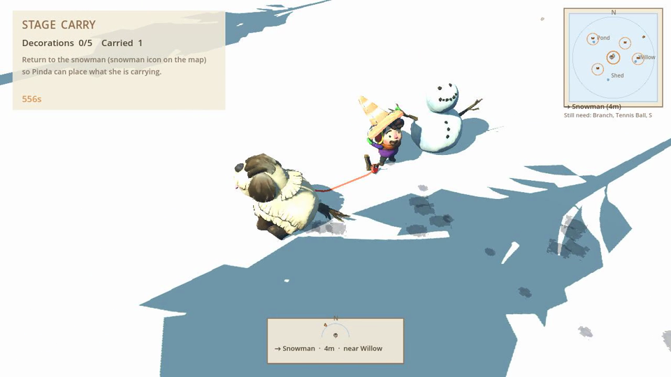

---

## dont_stop

2D 俯视科幻射击 · 2D

Scale tier / 规模档位: **S** — 1 independently addressable course, 1 player, 1 full combat round, 1 exit, and 2 distinct ending scenes.

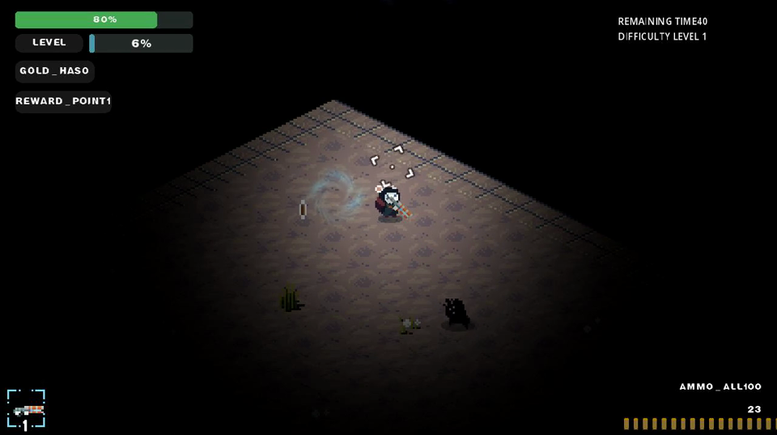

---

## dungeon_escape

**The Ember Key** · Top-down 2D action-adventure; single-player; keyboard only · 2D

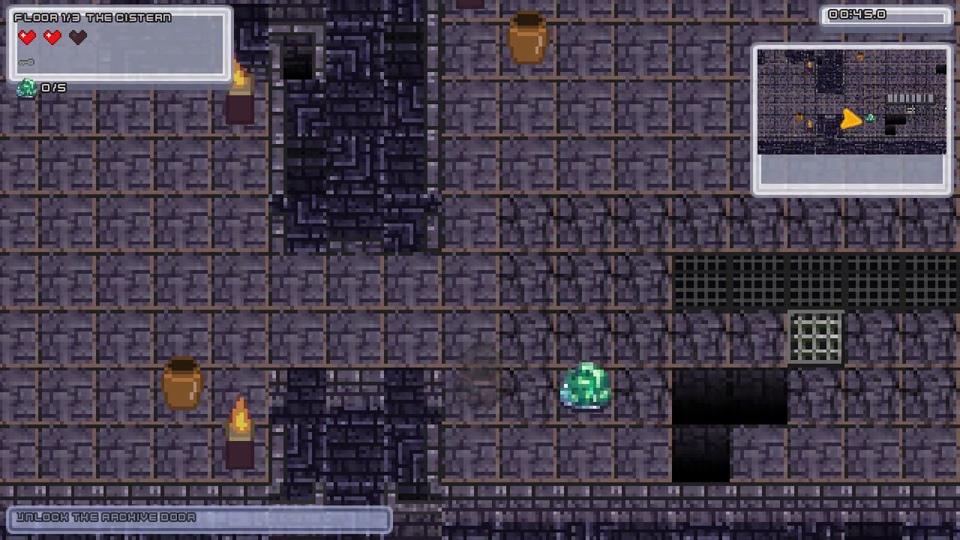

---

## ember_and_tide

**Ember & Tide** · single-player co-operative-pair puzzle platformer, 2D, single-screen chambers · 2D

Ember & Tide is a two-avatar co-operative elemental puzzle platformer for one player at one keyboard. You drive **both** characters — Ember on `A`/`W`/`D`, Tide on the arrow keys — through ten single-screen puzzle chambers. Each avatar can wade safely through its own element and dies instantly in the other's, and a third corrosive fluid kills both. A chamber is complete only when **both** avatars stand on their own exits **at the same time**.

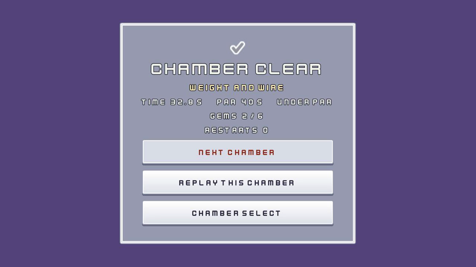

---

## gentlemans_adventure

**Another Gentleman's Adventure** · 2D 横版平台射击（side-scrolling run & gun platformer） · 2D

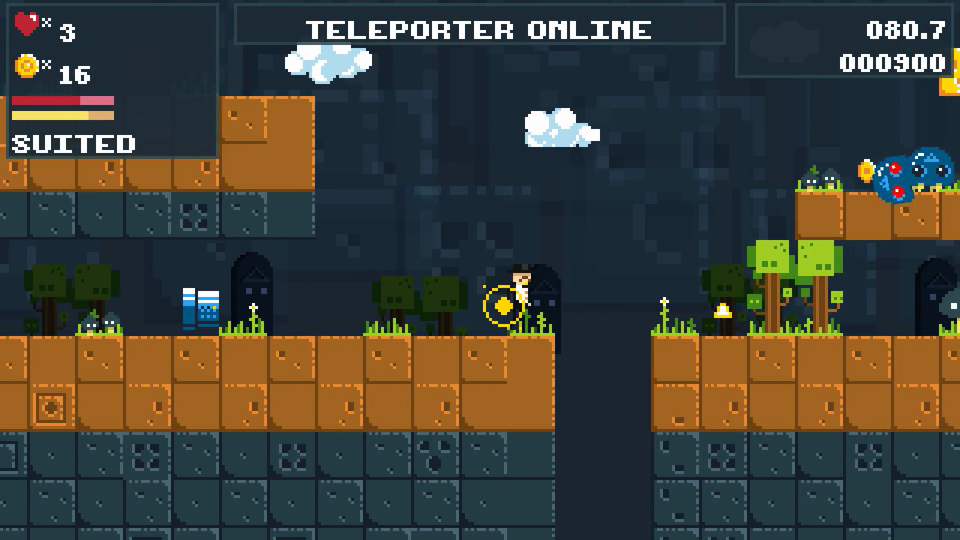

---

## gunfire_dungeon

**枪火地牢** · 2D 俯视地牢射击。 · 2D

本作把权威规格 `game_description.md` 落成可启动的 Godot 4.5.1 工程。玩家在房间图里清敌、开门、买枪、打 Boss，生命归零则回标题并清掉本局临时进度。

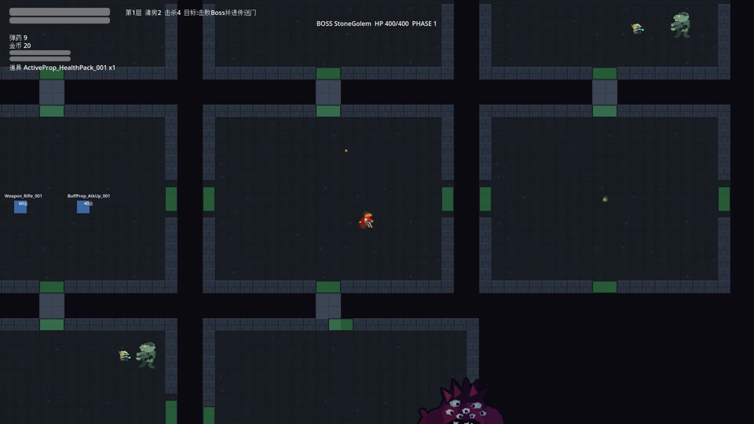

---

## harvest_ledger

**Harvest Ledger** · 俯视 2D 农场生活模拟 / 有期限的轻策略经营 · 2D

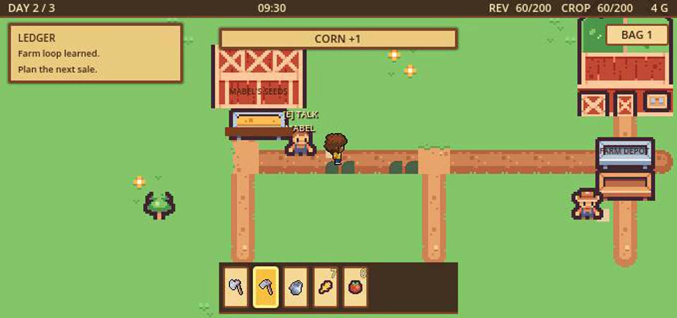

---

## hazard_circuit

**Hazard Circuit** · 2D side-view hazard-course parkour platformer, single player, keyboard only · 2D

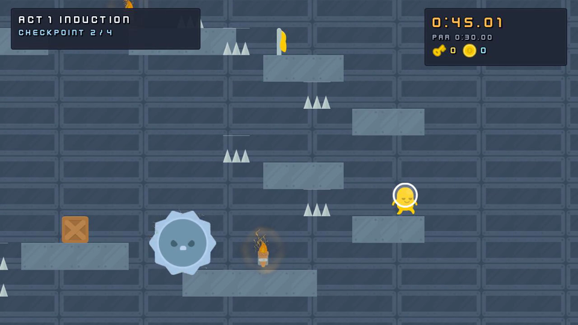

---

## hive_flight

**Hive Flight (蜂巢惊魂)** · 2D side-scrolling pixel-art runner / obstacle platformer with a one-shot chase escalation · 2D

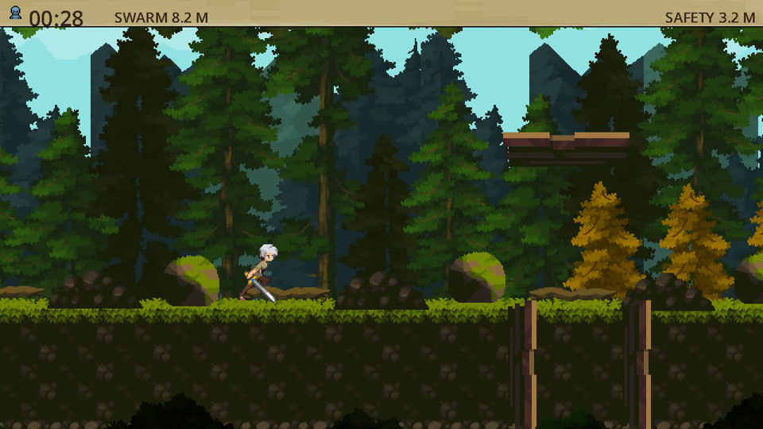

---

## hurry_curry

**HURRY CURRY! — Junior Kitchen CodingBenchmark GDD** · 单人 3D 时间规划/烹饪交互 · 3D

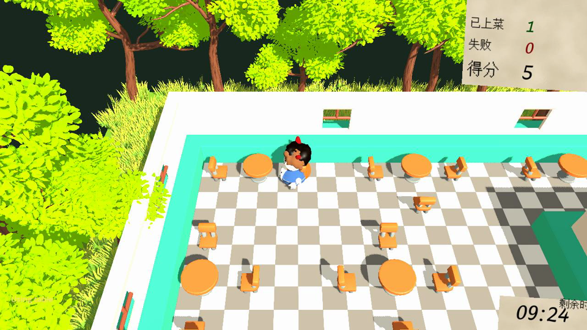

---

## kindle_relay

**KINDLE RELAY** · 3D 球形世界点灯探索 · 3D third-person

Kindle Relay is a 6–8 minute third-person exploration game on one continuous spherical planet. The player is the last lamplighter. Six beacons are dark; the lantern is fading. Movement, line-of-sight navigation and the Call reveal paths around a close curved horizon. Lighting all six beacons restores sunrise.

---

## ninja_roguelite

**GDD — 灯明の見張り / LANTERN VIGIL** · 俯视 2D 动作 roguelite（run-based，单局制） · 2D

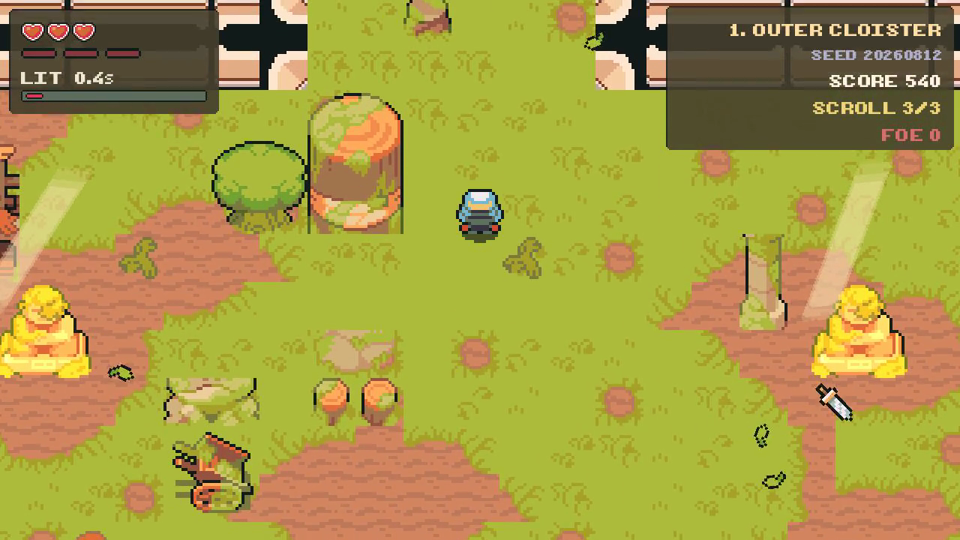

---

## pixel_platformer

**DYNAMO** · 2D pixel-art puzzle-platformer with a world-state metronome and player-authored terrain · 2D

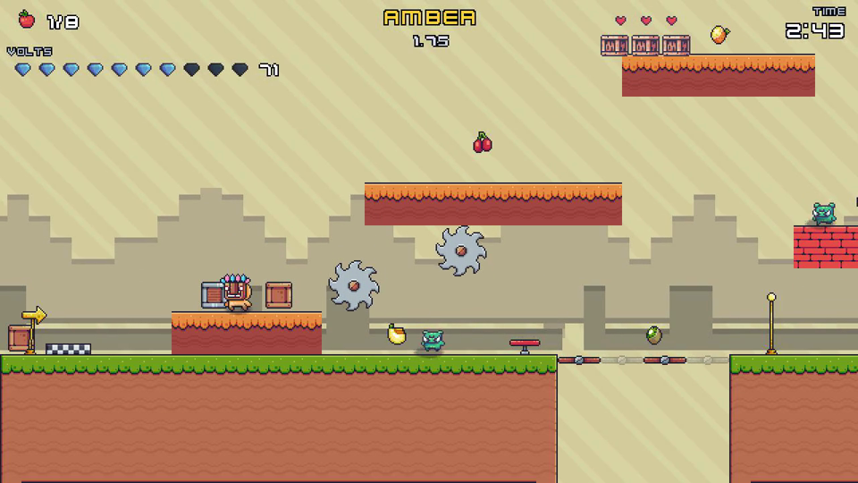

---

## pixel_platformer_v2

**Pixel Platformer** · 2D single-screen precision platformer, four themed rooms · 2D

---

## pixel_sabotage

**Pixel Sabotage** · Single-player first-person 3D stealth infiltration · 3D first-person

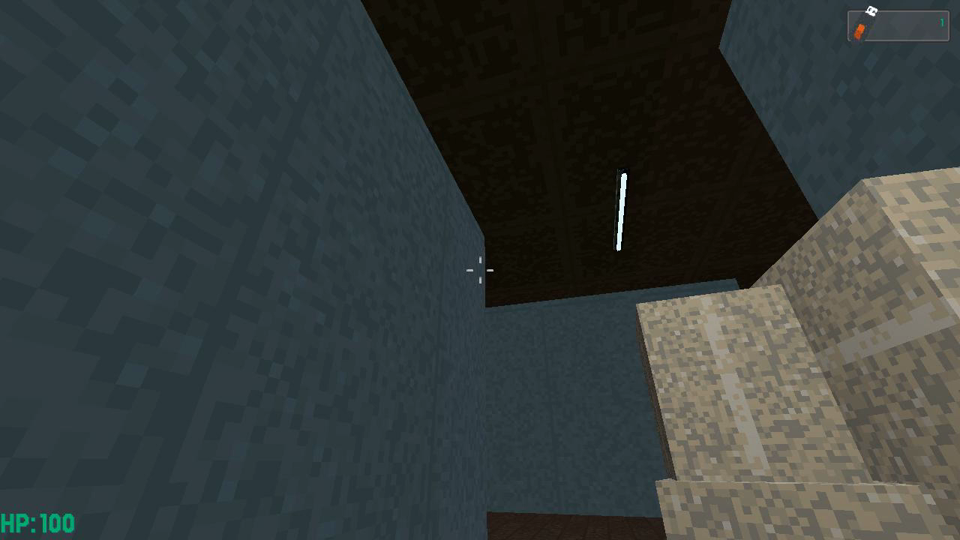

---

## pulse_lane

**Pulse Lane** · Four-lane vertical-scroll rhythm game, keyboard only · 2D

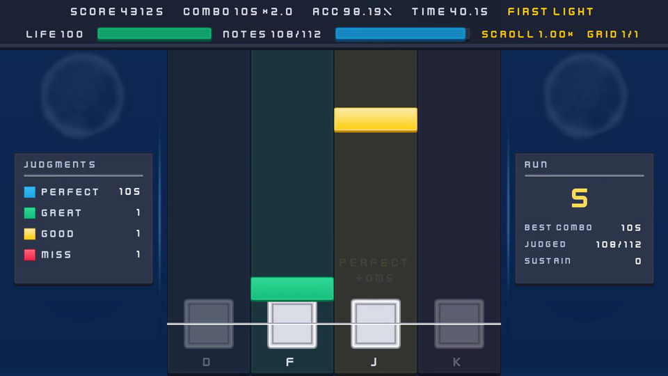

---

## racing

**Apex Circuit** · Third-person circuit racer, five-car grid, three laps · 3D

The whole game is one question asked eight times a lap: *how late can I brake?* Everything else — the tyre window, the surface table, the short cut, the rivals — exists to keep changing the answer.

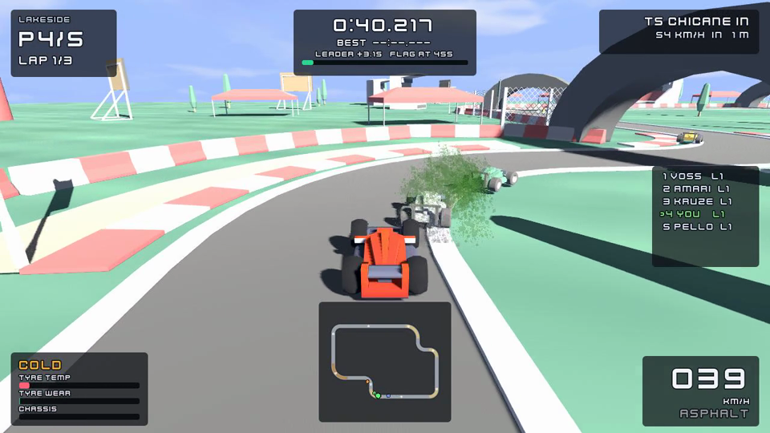

---

## relic_runner

**Relic Runner** · Top-down 2D dungeon errand-runner: clear a room, carry the thing, don't get hit · 2D

The spec's "Intentionally excluded scope" list is treated as a hard ceiling: no multiplayer, no save files, no controller/touch, no difficulty settings, no randomisation of any kind, no projectiles, no second weapon, no monster pathfinding, no respawns, no sprint/dash, no two-item carrying, no minimap, no dynamic lighting, nothing beyond the three levels. Anything in that list that this project *could* have added and did not is not a defect.

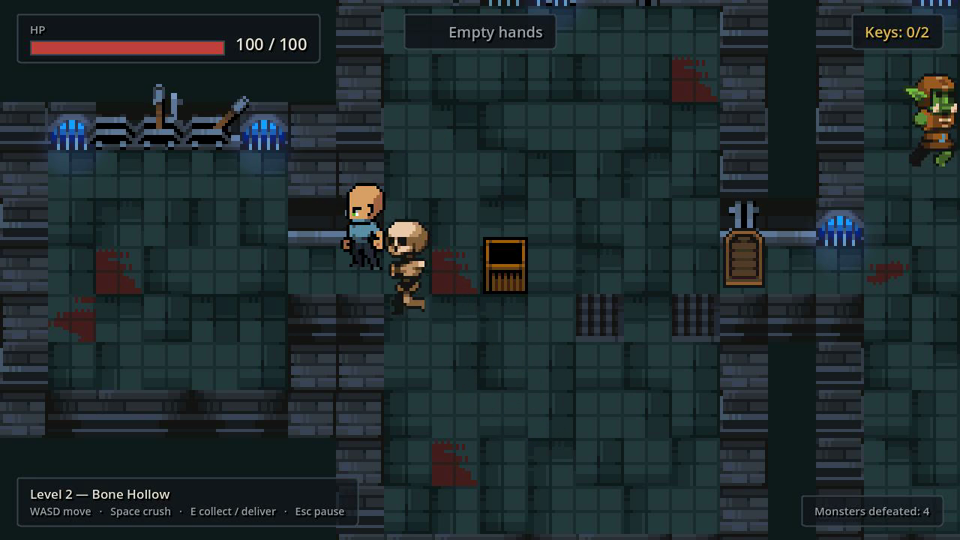

---

## sands_of_the_restless

**Sands of the Restless** · First-person survival wave shooter with exploration and purchases · 3D first-person

Genre: First-person survival wave shooter with exploration and purchases.

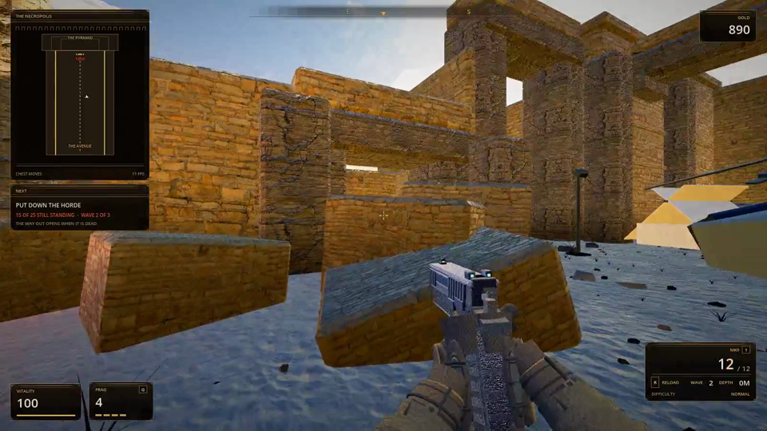

---

## shadow_walker

**Shadow Walker (影行者)** · Top-down 2D stealth, single unarmed character, no combat · 2D

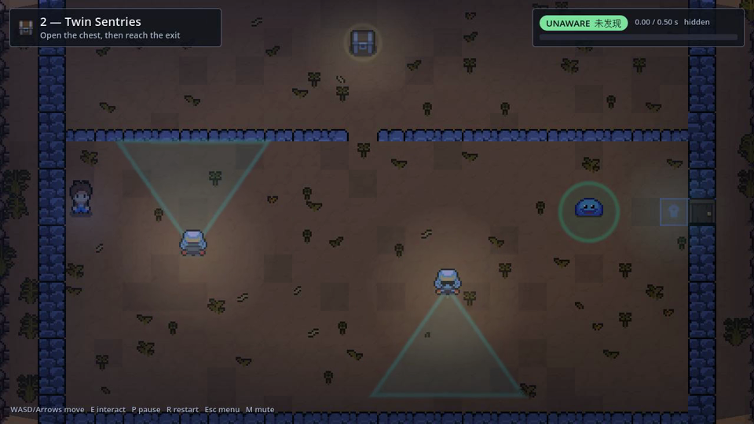

---

## soccer_course

**Soccer Course GDD** · Top-down pixel soccer action game · 2D

Soccer Course 是俯视像素足球动作赛：玩家控制法国队的一名场上球员，抢球、传球、射门并在真实球门判定区得分。标准锦标赛和 Bench 独立比赛均为 **2 min**，完整三轮约 **6–10 min**；内容规模为 1 个可独立进入球场、8 支国家队和 3 轮淘汰赛。核心幻想是用简洁方向与双动作输入完成一次可读的团队进攻并守住完整比赛结果。

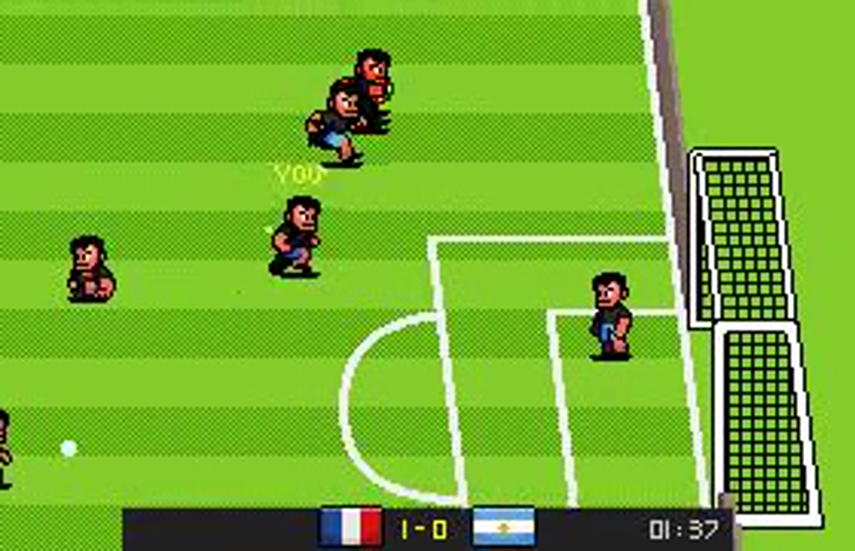

---

## super_dungeon_delve

**Super Dungeon Delve** · 2D 俯视像素动作地牢 · 2D

俯视像素动作地牢；玩家扮演 Sir Pixelot，在未知 BSP 地牢中判断路线、清怪、取舍宝物与生命，并连续找到四层出口。标准一局 **6–12 min**，规模固定为 **4 levels**、3 类敌人、2 类拾取物和 1 个出口目标。核心幻想是在危险、黑暗而紧凑的地牢中带着战利品活着深入。

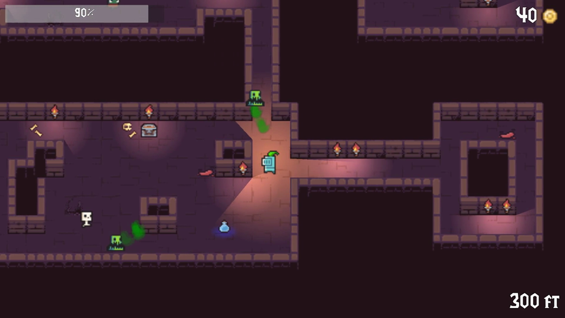

---

## terraforge

First-person voxel sandbox with a finite, seeded crafting objective · 3D first-person

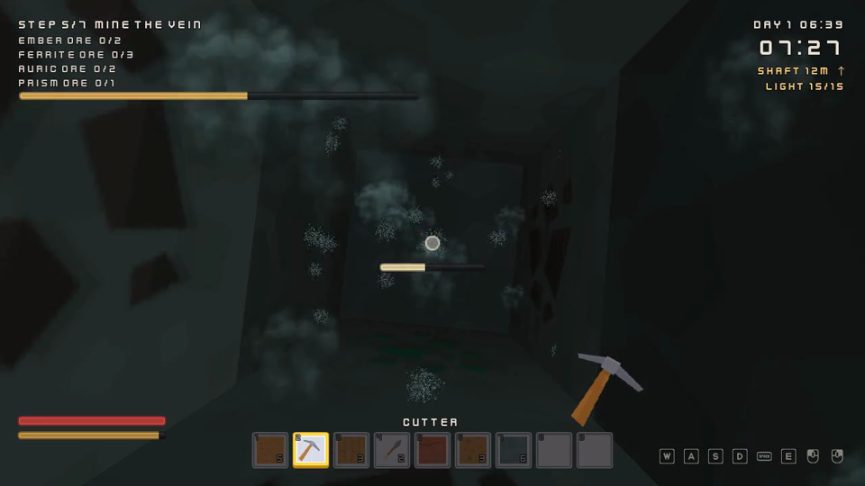

---

## tiny_rts

**Bannerfall: Tiny Kingdoms** · 2D 俯视即时战略（RTS），键盘完备操作，英雄带队制。 · 2D

_磁盘上没有任何截图——这个工程从未被抓过帧。_

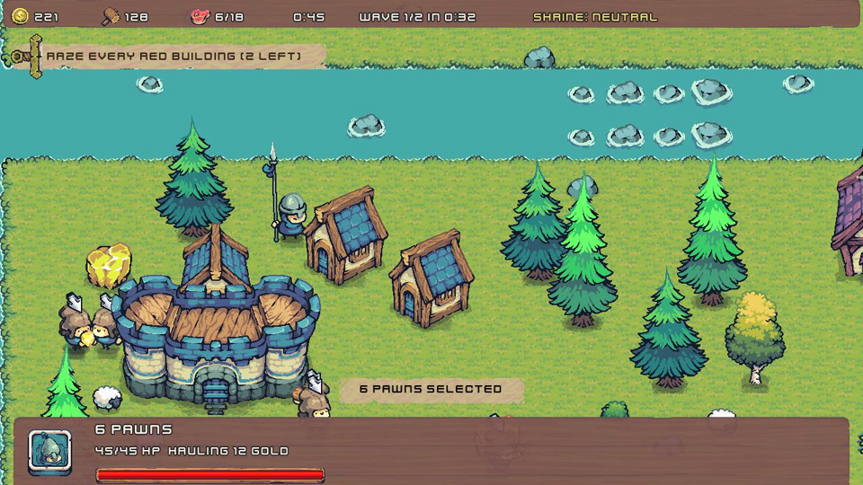

---

## toon_shooter

**SCRAPLINE SIEGE** · Third-person 3D arena shooter, wave-based siege defence · 3D third-person

The wave and par numbers above were wrong in the previous revision in a way worth recording, because it is the failure mode this rewrite exists to catch: they described a *design intention* (1 / 2 / 2 waves, par 42 / 40+55 / 38+70) that the implementation had moved past months earlier, and nothing ever compared the two. `core/tuning.gd` is the only place wave composition lives, so §5 is now transcribed from it rather than written alongside it.

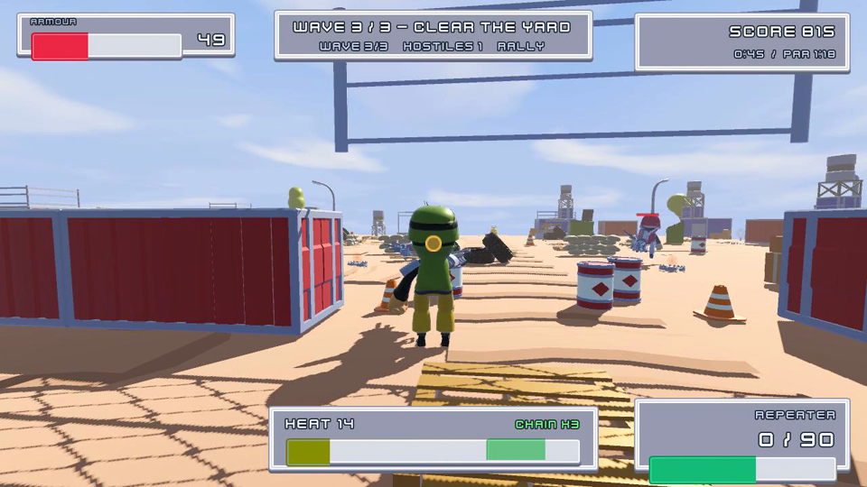

---

## twin_holds

**Twin Holds** · Turn-based strategy on a hexagonal board, one human side against a fixed script · 3D

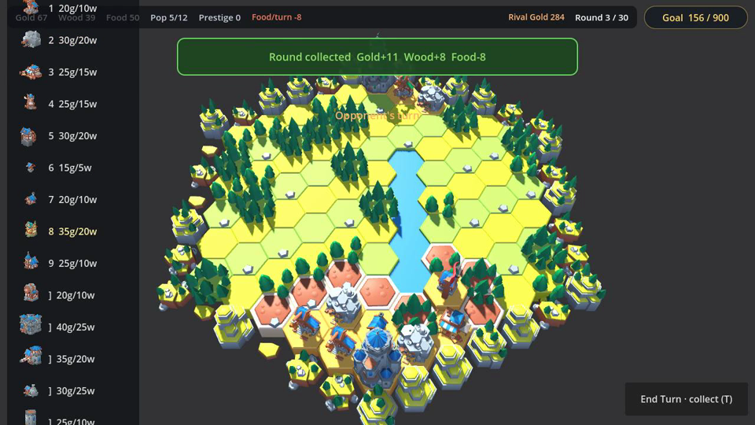

---

## vaultline

2D precision momentum-parkour platformer. No combat, no defeatable enemies · 2D

Threats are static or on a fixed deterministic cycle, so a failed attempt is always the player's read of the geometry, never a dice roll. Death is cheap (instant respawn at the last checkpoint) and the run-level cost is a shared **death budget** rather than lives.

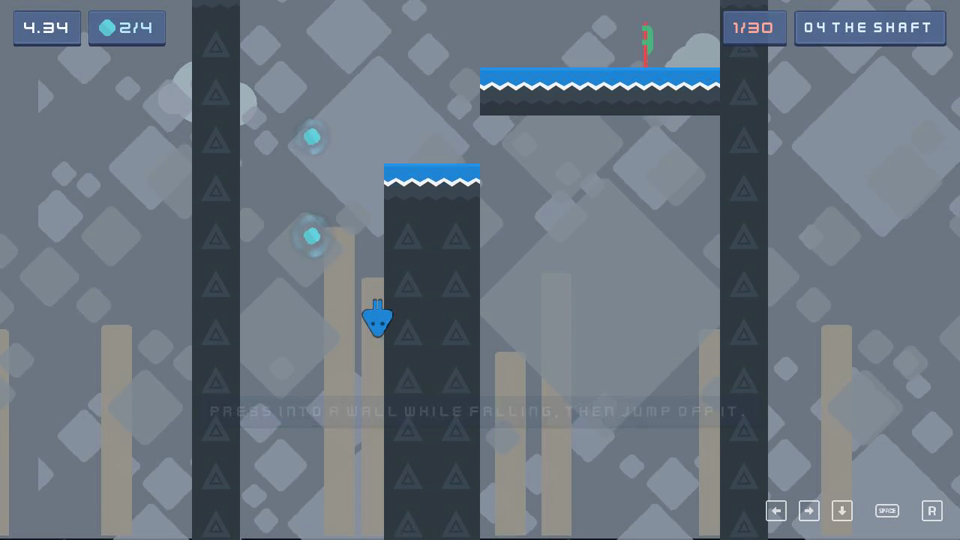

---

## volley_break

**Volley Break** · Single-screen 2D sports/action hybrid — a Pong-style paddle duel fought across a Breakout wall · 2D

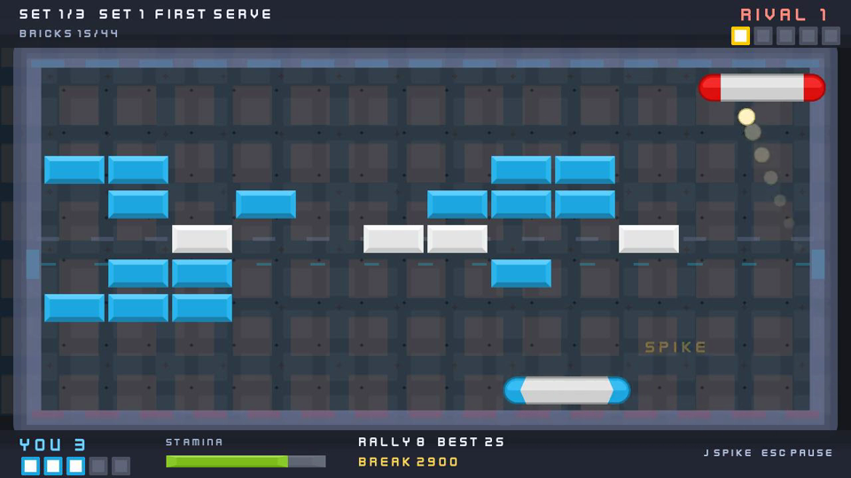

---

## where_the_dead_lie

**Where The Dead Lie — CodingBenchmark GDD** · 单人第一人称 3D 恐怖探索与资源搜索 · 3D first-person

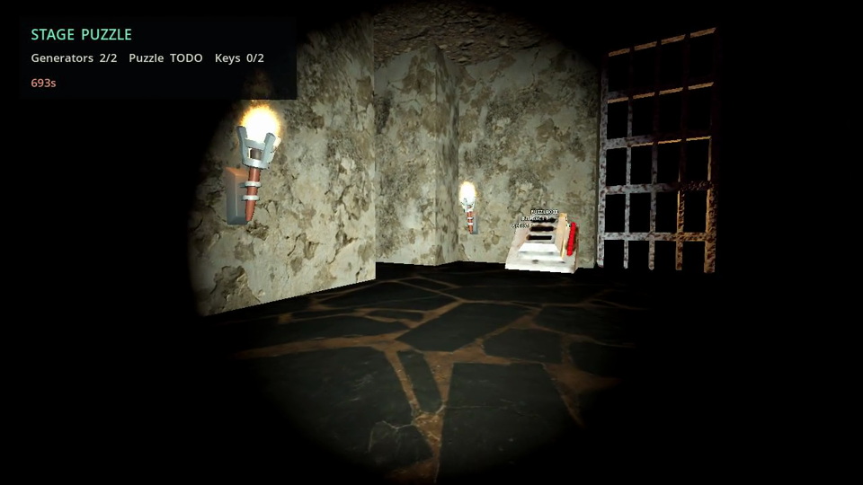

---

## wizard_chase

**Wizard Chase** · 2D 俯视单屏迷宫追逐 · 2D

Wizard Chase is a top-down, single-screen maze-chase game about a wizard stealing treasure from five increasingly hostile dungeon rooms. A complete run is estimated at **8–12 minutes** (design target; revise after the first certified L5 recording). The fixed scope tier is **5 rooms**, one continuous run, four enemy archetypes, two timed-hazard families, and one defensive spell. The player begins outside each maze, crosses the threshold to start the chase, clears all coins (code gate: `get_total_coins_left()==0`), exits through the opened door, and wins only after Room 5.

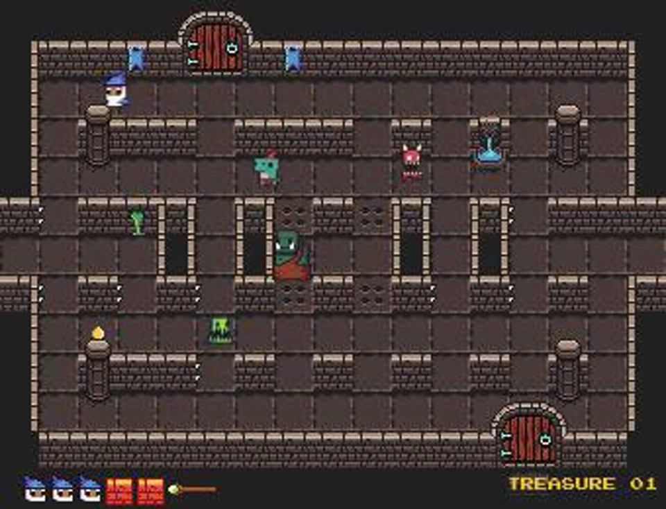

---

## sprout_market

**Sprout Market** · Single-screen real-time shop management / arcade logistics · 2D

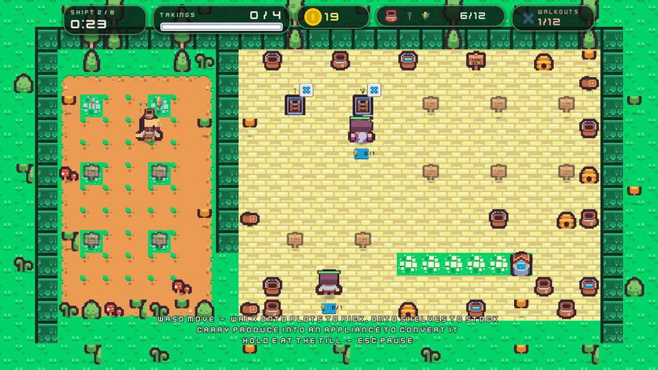

