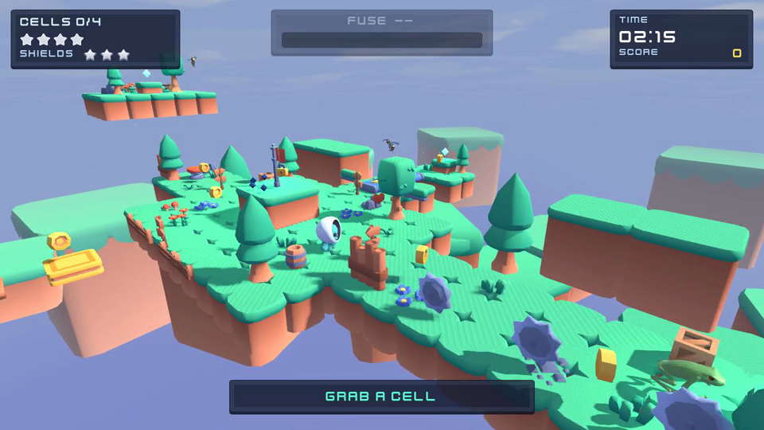
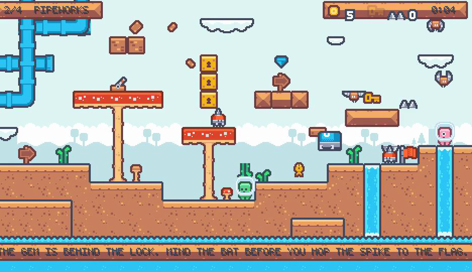
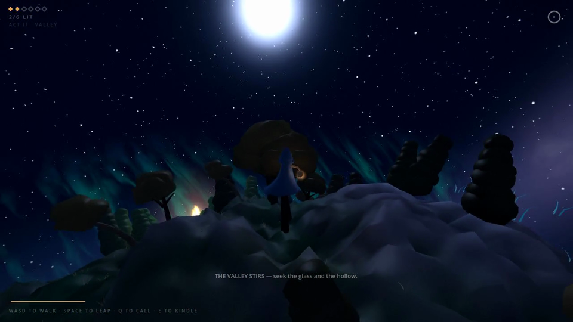

<div align="center">

# SWE-Game: Can Coding Agents Build the Games We Want?

[](https://arxiv.org/abs/2609.33678)
[](https://huggingface.co/datasets/Charly-chan/SWE-Game)

41 reference games · 5 task types · 246 released tasks

[Tasks](#tasks) · [Main Results](#main-results) · [Evaluation](#evaluation) · [Quick Start](#quick-start) · [Game Gallery](GAMES.md) · [Dataset](#reference-data) · [Repository](#repository-structure) · [Documentation](#documentation) · [Citation](#citation)

</div>

SWE-Game is a benchmark for coding agents across five game development tasks: building games from briefs or design documents, completing code skeletons, repairing bugs, and porting Godot games to Unity.

The benchmark covers **41 reference games** spanning 2D and 3D platforming, action, puzzles, driving, and strategy. Agents receive task-specific requirements and materials; the evaluator runs their submissions, replays player inputs, and assesses game mechanics, progression, playability, and visual quality.

Use this repository to **run an agent**, **evaluate a submission**, or **reproduce a benchmark run**. Task packages, reference projects, assets, and gameplay recordings are available in the [Hugging Face dataset](https://huggingface.co/datasets/Charly-chan/SWE-Game).

<table>
  <tr>
    <td width="33%"></td>
    <td width="33%"></td>
    <td width="33%"></td>
  </tr>
  <tr>
    <td align="center">Beacon Relay</td>
    <td align="center">Pixel Platformer v2</td>
    <td align="center">Kindle Relay</td>
  </tr>
</table>

*Example reference-game screenshots. Explore the [full game gallery](GAMES.md).*

## Tasks

Five task types vary the information available to the agent and the development work it must perform:

| Task type | Goal | Main agent inputs | Deliverable | Inventory |
| --- | --- | --- | --- | ---: |
| **Brief-to-Game** | Design and build a game | Brief, assets, reference video | Game design document and Godot project | 41 |
| **GDD-to-Game** | Implement a specified game | Game design document, assets, reference video | Godot project | 41 |
| **Skeleton Completion** | Complete a game from a minimal framework | Code skeleton, task requirements, assets, reference video | Completed Godot project | 41 |
| **Bug Repair** | Repair a game while preserving its behavior | Faulty project, gameplay requirements, bug report | Repaired Godot project | 82 active cases |
| **Godot-to-Unity Porting** | Preserve a game's behavior across engines | Godot source, design document, assets, reference video, Unity interface | Unity project and build instructions | 41 |

Counts describe this fixed release. The paper evaluates 247 tasks, including 83 Bug Repair cases; this release includes 82 repair cases. See the [task protocol](docs/tasks.md) for submission requirements and [catalog](catalog.json) for game identifiers.

## Main Results

The following tables reproduce **Table 3** of the [paper](https://arxiv.org/html/2609.33678v1#S4.T3). Scores range from **0 to 100**, with higher values indicating better performance. The paper evaluates 247 tasks, including 83 Bug Repair cases; this fixed release contains 82 repair cases. Models use their respective agent frameworks as described in [Section 4.1](https://arxiv.org/html/2609.33678v1#S4.SS1).

### Brief-to-Game

| Model | Mechanics | Content | Playability | Design | VLM | Total |
| --- | ---: | ---: | ---: | ---: | ---: | ---: |
| Qwen3.8 Flash | 21.10 | 23.32 | 28.38 | 65.85 | 40.40 | 27.00 |
| Grok4.6 | 25.66 | 35.34 | 61.21 | 70.00 | 48.39 | 39.01 |
| GPT-5.6 Luna | 24.17 | 21.29 | 55.51 | **92.68** | 60.05 | 34.18 |
| Opus5 | **27.55** | **48.26** | **80.99** | 53.85 | **69.23** | **50.38** |
| GLM5.3 Flash | 17.25 | 33.07 | 44.51 | 61.33 | 33.03 | 31.05 |
| Minimax M3 | 25.30 | 27.20 | 42.65 | 67.50 | 32.09 | 30.47 |

### GDD-to-Game

| Model | Mechanics | Content | Playability | VLM | Total |
| --- | ---: | ---: | ---: | ---: | ---: |
| Qwen3.8 Flash | 25.07 | 32.25 | 64.75 | 49.61 | 37.35 |
| Grok4.6 | 28.66 | 53.58 | 59.60 | 60.20 | 48.55 |
| GPT-5.6 Luna | 31.52 | 53.52 | 76.57 | 67.06 | 52.67 |
| Opus5 | **32.96** | **61.07** | **91.94** | **75.03** | **59.68** |
| GLM5.3 Flash | 26.21 | 37.83 | 69.45 | 45.84 | 40.18 |
| Minimax M3 | 32.84 | 38.05 | 72.51 | 46.19 | 42.58 |

### Skeleton Completion

| Model | Mechanics | Content | Playability | Scaffold | VLM | Total |
| --- | ---: | ---: | ---: | ---: | ---: | ---: |
| Qwen3.8 Flash | 24.60 | 20.99 | 65.51 | 91.15 | 58.40 | 39.19 |
| Grok4.6 | 26.92 | 16.03 | 80.75 | 86.36 | 70.08 | 40.76 |
| GPT-5.6 Luna | 29.57 | 17.70 | 82.35 | 88.44 | 73.87 | 43.10 |
| Opus5 | **36.22** | **36.93** | **93.77** | **94.62** | **78.36** | **54.06** |
| GLM5.3 Flash | 22.63 | 11.97 | 82.70 | 79.13 | 49.90 | 34.38 |
| Minimax M3 | 21.87 | 20.03 | 79.09 | 74.39 | 47.49 | 35.69 |

### Bug Repair

| Model | Restoration | Retained routes | Preservation contracts | Validity gates | Total |
| --- | ---: | ---: | ---: | ---: | ---: |
| Qwen3.8 Flash | 44.40 | 98.61 | 80.56 | 98.61 | 26.13 |
| Grok4.6 | 56.52 | 96.88 | 85.94 | 99.72 | 52.44 |
| GPT-5.6 Luna | 69.62 | 98.35 | 86.08 | 99.72 | 58.05 |
| Opus5 | **90.18** | **99.51** | **93.17** | 99.72 | **83.46** |
| GLM5.3 Flash | 44.34 | 96.00 | 75.51 | **99.85** | 27.55 |
| Minimax M3 | 35.27 | 96.05 | 76.32 | 94.74 | 27.36 |

### Godot-to-Unity Porting

| Model | Mechanics | Playability | Structure | Visual | Stability | Total |
| --- | ---: | ---: | ---: | ---: | ---: | ---: |
| Qwen3.8 Flash | 57.31 | 50.39 | 50.27 | 36.78 | 55.20 | 51.23 |
| Grok4.6 | 61.71 | 50.26 | 78.76 | 35.40 | 77.50 | 59.04 |
| GPT-5.6 Luna | 63.26 | 51.44 | 82.87 | 31.60 | 76.80 | 59.85 |
| Opus5 | **70.66** | **65.88** | **90.53** | **58.40** | **88.60** | **72.40** |
| GLM5.3 Flash | 50.37 | 38.32 | 63.13 | 12.13 | 58.30 | 44.33 |
| Minimax M3 | 53.44 | 48.31 | 42.74 | 49.28 | 50.32 | 49.62 |

**Reading the table.** Bold marks the best result in each column within a task. Content includes asset realization; Design assesses the authored GDD; Scaffold assesses completion and integration. For construction tasks, Mechanics includes certified reference-input routes, and Playability covers demonstration validity, feature coverage, and behavior relative to matched no-input controls. Totals follow [Section 3.4](https://arxiv.org/html/2609.33678v1#S3.SS4); Bug Repair totals average per-task products of the component factors.

## Evaluation

Evaluation combines two evidence domains:

- **Objective Behavioral Evaluation** executes the submitted project and checks input responses, observable mechanics, progression, and mode-specific requirements. Matched no-input controls help determine whether demonstrated behavior depends on player action.
- **Perceptual Quality Assessment** uses the paper’s four rubric groups: visible mechanics, design and content, functional visual communication, and art.

The three construction tasks allocate 85 objective points and 15 game-specific VLM points. Bug Repair measures behavioral restoration and preservation. Godot-to-Unity Porting allocates 70 objective points, 15 structure VLM points, and 15 visual-quality VLM points. Strict completion (`resolved`) is reported separately from the graded score.

Visual judging is disabled by default. A complete construction or porting score requires VLM evidence; otherwise the composite remains null. See the [scoring specification](docs/reference/HIERARCHICAL_MULTI_EVIDENCE_SCORECARD.md) for weights and registries, and [paper Section 4.5](https://arxiv.org/html/2609.33678v1#S4.SS5) for human agreement studies. For reproducibility, record the evaluator commit, registry, model, harness, budget, input settings, and judge configuration.

## Quick Start

The runner targets Linux x86-64 (Ubuntu 22.04/24.04), with root or sudo and user-namespace support. Setup installs Godot **4.5.1** and the pinned agent CLIs. Porting evaluation additionally requires a licensed Unity **6000.3.23f1** [certified VM](eval/infra/unity/README.md).

```bash
git clone --depth 1 https://github.com/Charly-chan/SWE-Game.git
cd SWE-Game
sudo ./setup.sh
./setup.sh --check
```

Reference game source, assets, and videos are hosted in the [Hugging Face dataset](https://huggingface.co/datasets/Charly-chan/SWE-Game). The runner downloads a fixed task package from a pinned dataset revision and verifies SHA-256 checksums. Configure your model provider using [.gb_api.env.example](.gb_api.env.example); see the [runner guide](docs/running.md) for setup details.

### Run an agent

The runner supports Codex and Claude Code harnesses. Choose a model identifier available through your configured provider:

```bash
MODEL_ID="your-model-id"

# Download one fixed task package and inspect the agent command without calling a model.
./run_benchmark.sh --game wizard_chase --mode brief \
  --harness codex --model "$MODEL_ID" --dry-run \
  --out results/brief-preview

# Run the agent and retain its submission for evaluation on a separate machine.
./run_benchmark.sh --game wizard_chase --mode brief \
  --harness codex --model "$MODEL_ID" --eval off \
  --out results/brief-agent
```

Batch runs, concurrency, budgets, and resume options are documented in the [runner guide](docs/running.md). [Docker](docker/README.md) and [Harbor](docs/harbor.md) provide additional execution options.

### Evaluate a submission

Pass the downloaded task package and the corresponding submission directory:

```bash
./evaluate.sh path/to/package path/to/submission \
  --out results/evaluation --visual-judge none
```

Use `--visual-judge vlm` for visual assessment. Reports and scores are written under the selected output directory; see the [output contract](docs/reference/OUTPUT_CONTRACT.md). Rescoring and adding visual evidence to saved runs are covered in [evaluation commands](docs/quickstart.md#evaluation-commands).

## Reference Data

The [Hugging Face dataset](https://huggingface.co/datasets/Charly-chan/SWE-Game) contains **246 fixed tasks**, **41 reference game projects**, and **41 reference recordings**. The 451 downloadable package variants cover the supported playtest-kit and Mode-1 video settings. GitHub hosts the evaluator, runners, fixed scoring data, documentation, and gallery screenshots. Original game and asset licenses are preserved with the data and indexed in [third-party notices](THIRD_PARTY_NOTICES.md).

The runner downloads the required data automatically. To prefetch one game and its primary recording:

```bash
python scripts/fetch_reference_data.py --game kindle_relay --with-videos
```

For the full corpus, use `--game all --with-videos`. See [data downloads](docs/reference-data.md) for pinned versions, checksums, storage, and recovery.

## Repository Structure

| Path | Purpose |
| --- | --- |
| [`.github/`](.github/AUTOMATION.md) | Automated tests, container publishing, and the pull request template |
| [`data/`](data/README.md) | Pinned task-data revision, download paths, and checksums |
| [`docker/`](docker/README.md) | Godot and Unity coding-agent images, build scripts, and toolchain checks |
| [`docs/`](docs/README.md) | User guides, scoring contracts, and game attribution |
| [`eval/`](eval/README.md) | Evaluator implementation, task definitions, interfaces, and reference evidence |
| [`scripts/`](scripts/README.md) | Data downloads, agent launchers, and evaluation utilities |
| `games/` | Reference projects downloaded from Hugging Face; created on demand and ignored by Git |
| `results/` | Local task packages, submissions, logs, and evaluation reports; ignored by Git |

The root entry points are [`setup.sh`](setup.sh) for installation,
[`run_benchmark.sh`](run_benchmark.sh) for agent runs, and
[`evaluate.sh`](evaluate.sh) for scoring saved submissions.
[`catalog.json`](catalog.json) lists the reference games and their metadata.

Inside `eval/`, [`taskgen/`](eval/taskgen/README.md) stores fixed visual rubrics,
[`tasks/`](eval/tasks/README.md) stores game-specific evaluation definitions and
baselines, and [`evalsys/`](eval/evalsys/README.md) contains task downloads, agent
execution, and submission evaluation.

## Documentation

| Resource | Contents |
| --- | --- |
| [Runner guide](docs/running.md) | Providers, batch execution, and reproducibility |
| [Task protocol](docs/tasks.md) | Inputs and submission requirements |
| [Evaluation overview (中文)](docs/evaluation.md) | Behavioral and perceptual evaluation |
| [Godot-to-Unity Porting](docs/reference/UNITY_MODE5.md) | Cross-engine setup and evaluation |
| [Documentation index](docs/README.md) | All guides and detailed contracts |

## Citation

If you use SWE-Game, please cite the [paper](https://arxiv.org/abs/2609.33678):

```bibtex
@misc{chen2026swegame,
  title         = {{SWE-Game}: Can Coding Agents Build the Games We Want?},
  author        = {Xiaoyu Chen and Lai Wei and Jin Wang and Xiangyu Zou and Ruochen Fan and Enze Luo and Mingzhe Yao and Jiahui Zhu and Yuhua Wen and Linghe Kong and Weiran Huang},
  year          = {2026},
  eprint        = {2609.33678},
  archivePrefix = {arXiv},
  primaryClass  = {cs.AI},
  url           = {https://arxiv.org/abs/2609.33678}
}
```
